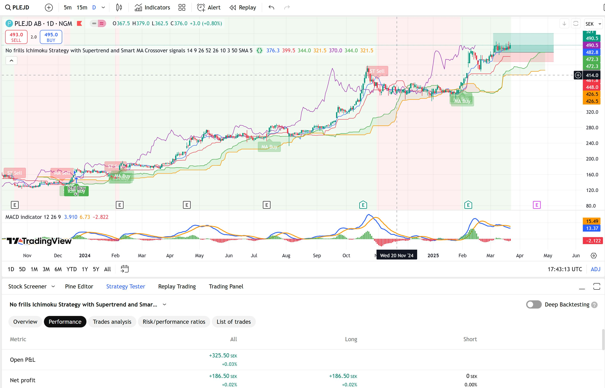

# No frills Ichimoku Strategy for Trading View
A TradingView long strategy made with PineScript

## Overview

* Buy when leading cloud is green, lagging span is over cloud and price (hl2) is above front cloud
* Sell when lagging span and price (hl2) goes under the cloud
* Stop-loss sell if price goes 10% under buy price

## Updates

- 2025-06-09: Bugfix lagging span swim marker
- 2025-06-05: Adds strategy starting values and start date to limit back tester + lagging span swim marker setting
- 2025-03-22: Adds Supertrend and Smart MA signals
- 2025-03-05: Added warning marker when the lagging span in starting to swim within 5% of the price
